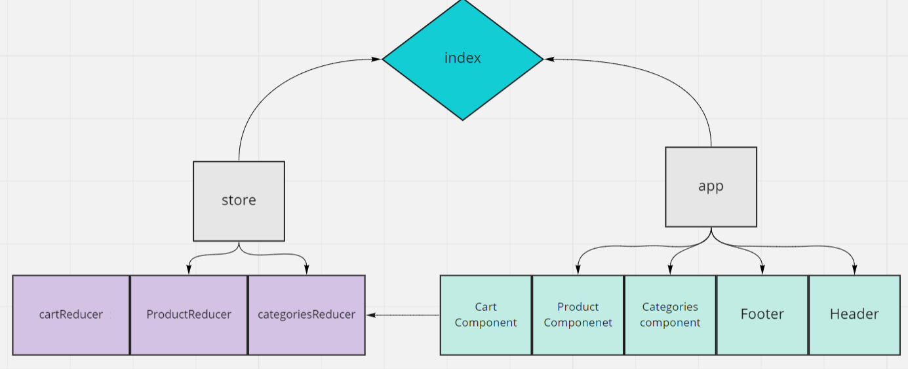

## LAB 36 - Application State with Redux
##### Virtual Store Phase 1: For this assignment, you will be starting the process of creating an e-Commerce storefront using React with Redux, coupled with your live API server

### Phase 1 Requirements
in this lab we begin the first of a 4-Phase build of the storefront application, written in React. In this first phase, our goal is to setup the basic scaffolding of the application with initial styling and basic behaviors. This initial build sets up the file structure and state management so that we can progressively build this application in a scalable manner

-  see a list of available product categories in the store so that I can easily browse products
-  the ability to choose a category and see a list of all available products matching that category
-  clean, easy to use user interface so that I can shop the online store with confidence

### Technical Requirements

- Create a visually appealing site using Material UI
- Use a Redux Store to manage the state of categories and items in the store
- Display a list of categories from state
- When the user selects (clicks on) a category …
- Identify that category as selected (change of class/display)
- Show a list of products associated with the category

## Links:

- PR: https://github.com/Batoolayyad/storefront/pull/1
- codesandbox: https://codesandbox.io/s/suspicious-marco-9t5cw

## UML:

## Lab 37: Redux - Combined Reducers

### Phase 2 Requirements
In phase 2, we will be adding the “Add to Cart” feature to our application, which will allow users to browse items in the store, also select them and have them persist in their “shopping cart” for later purchase.

For phase 2, we are now adding the following requirements:

- choose from products in the list and add them to my shopping cart
- see the products that I’ve added to my shopping cart so that
- change the quantity of items I intend to purchase in my shopping cart
- be able to remove an item from my shopping cart

#### Application Flow:

- User sees a list of categories
- Chooses a category and sees a list of products
-  Clicks the “Add to Cart” button on any product
- Clicks the “Cart” link in the header
- Sees a list of all products in the cart
- Clicks the delete button on an item and sees the item removed
- Changes the quantity selector on an item and sees the cart total change

## Links:
- PR: https://github.com/Batoolayyad/storefront/pull/3 , https://github.com/Batoolayyad/storefront/pull/5
- codesandbox: https://codesandbox.io/s/zealous-dhawan-06nzm

## UML:

## LAB 38 - Redux - Asynchronous Actions
Virtual Store Phase 3: Connect the Virtual Store to an API to retrieve live data from your data source, using thunk to enable asynchronous actions

#### Phase 3 Requirements
In phase 3, we will be connecting our Virtual Store to a live API so that our data is persistent and able to be separately managed.

For this phase, we are now adding the following requirements.

- interact with live inventory so that I have confidence that the displayed products are in stock
- add an item to my cart, that it is removed from inventory so that no other users can purchase it

#### Technical Requirements

- Continue to use Material UI Components for layout and styling
- Load the category and product list from a remote API on page load.
- Update the product quantity in stock when adding items to (or removing from) the cart
- Continue to use multiple reducers
- Notes on State Management
- You will need to use useEffect() to dispatch a load action on the initial page load
- This will need to use thunk as it will be asynchronous
- When adding/removing/updating items in the cart, the action/reducer will need to update the server
- Perform the appropriate post, put, or delete action via API call (using thunk in an async action) on each of these actions as performed by the users

## Links: 
- PR: https://github.com/Batoolayyad/storefront/pull/6
- codesandbox: https://codesandbox.io/s/dawn-resonance-7thyh

## UML:

