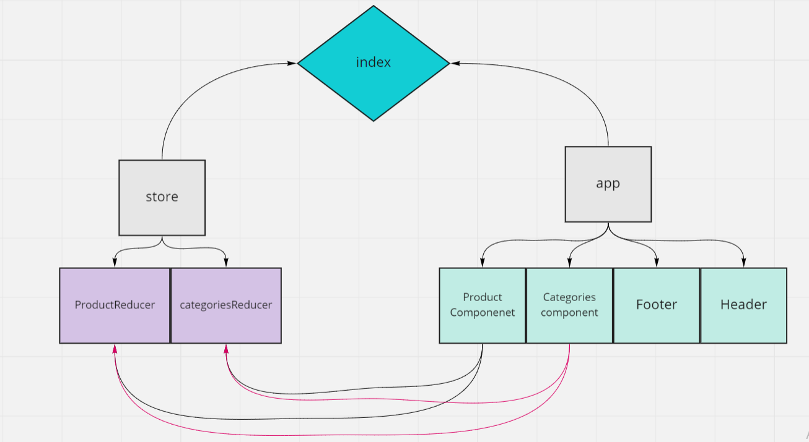

## LAB 36 - Application State with Redux
##### Virtual Store Phase 1: For this assignment, you will be starting the process of creating an e-Commerce storefront using React with Redux, coupled with your live API server

### Phase 1 Requirements
in this lab we begin the first of a 4-Phase build of the storefront application, written in React. In this first phase, our goal is to setup the basic scaffolding of the application with initial styling and basic behaviors. This initial build sets up the file structure and state management so that we can progressively build this application in a scalable manner

-  see a list of available product categories in the store so that I can easily browse products
-  the ability to choose a category and see a list of all available products matching that category
-  clean, easy to use user interface so that I can shop the online store with confidence

### Technical Requirements

- Create a visually appealing site using Material UI
- Use a Redux Store to manage the state of categories and items in the store
- Display a list of categories from state
- When the user selects (clicks on) a category …
- Identify that category as selected (change of class/display)
- Show a list of products associated with the category

## Links:

- PR: https://github.com/Batoolayyad/storefront/pull/1
- codesandbox: https://codesandbox.io/s/suspicious-marco-9t5cw

## UML:
